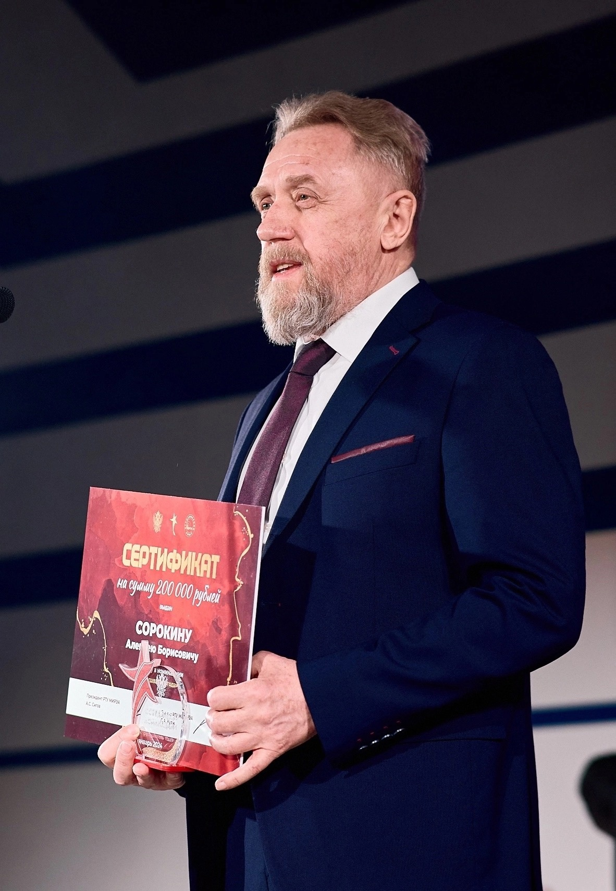

# Информация о дисциплине

Репозиторий представляет материалы по дисциплине ***Проектирование и обучение нейронных сетей, часть вторая***, прочитанной в **2025** году.

Дисциплина прочитана кафедрой ***Вычислительной техники (ВТ)***

Курс лекций провёл
***Сорокин Алексей Борисович***,
кандидат технических наук, доцент кафедры вычислительной техники,
лауреат звания «Преподаватель года».

  
   
  <strong>Рисунок 1 - Сорокин Алексей Борисович</strong>

Практические занятия курса провёл
***Семёнов Роман Эдуардович***,
практикующий специалист в области машинного обучения и нейронных сетей.

  
   
  <strong>Рисунок 2 - Семёнов Роман Эдуардович</strong>

В папке ***Лекции*** находятся pdf-файлы лекций курса. Для каждой практической работы создана отдельная папка. Отчет по практическим работам доступен в форматах ***.docs*** и ***.pdf***.

# Практическая часть

Практическая часть курса включала выполнение работ по следующим темам:
1. **Трансформер**
2. **Генеративная сеть (GAN)**
3. **Графовая сеть (GNN)**